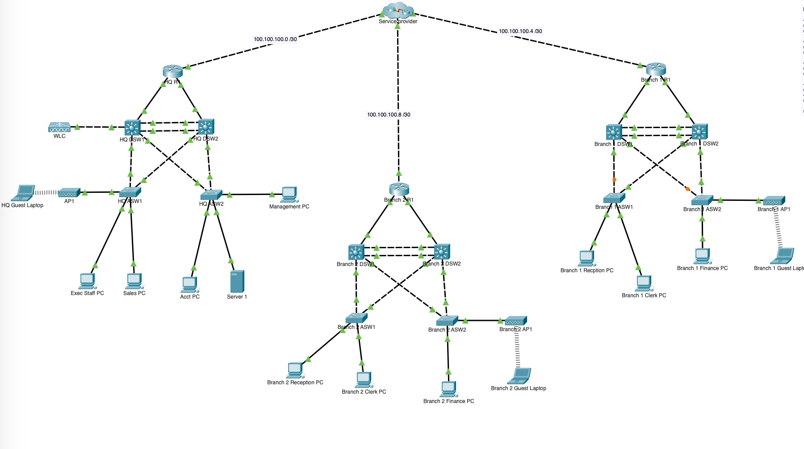

# Networking Lab | Project 17  Documentation

### Table of Contents
- [Networking Lab | Project 17  Documentation](#networking-lab--project-17--documentation)
    - [Table of Contents](#table-of-contents)
    - [1. Objectives](#1-objectives)
    - [2. Project Overview:](#2-project-overview)
    - [3. Topology](#3-topology)
    - [4. IP Addressing Scheme](#4-ip-addressing-scheme)
    - [5. VLAN CONFIGURATION](#5-vlan-configuration)
    - [6. Spanning Tree (STP) Configurations :](#6-spanning-tree-stp-configurations-)
    - [7. HSRP (Hot Standby Router Protocol) Configuration :](#7-hsrp-hot-standby-router-protocol-configuration-)
    - [8. Routing Protocol](#8-routing-protocol)
    - [9. DHCP](#9-dhcp)
    - [10. VPN Configuration](#10-vpn-configuration)
    - [11. Wireless LAN Controller (WLC) Setup](#11-wireless-lan-controller-wlc-setup)
    - [12. Conclusion](#12-conclusion)
    - [13. Project Limitations:](#13-project-limitations)
    - [14. Refferences](#14-refferences)

### 1. Objectives

To create a seccure site-to-site communication between WAN sites while each site prioritizes redundancy and network availabity. 

### 2. Project Overview:

Each site is connected via an IPSec VPN through an ISP, ensuring secure communication over the WAN. The network includes VLANs for segmentation, HSRP for gateway redundancy, and a centralized Wireless LAN Controller (WLC) located at HQ to manage access points across all sites.

### 3. Topology

This network design encompasses three interconnected sites:
1. Headquarters (HQ)
2. Branch 1 (BR1)
3. Branch 2 (BR2)

As shown in the topology image, Each site including the HQ has a router, 2 L3 distribution switches, 2 access layer switches and a wireless access point.

### 4. IP Addressing Scheme 

| Location        | Network                | Subnet Mask  | Description      |
|-----------------|------------------------|--------------|------------------|
| **HQ**          | 192.168.1.0            | /24          | Host devices     |
|                 | 10.10.10.0             | /28          | L3 links         |
| **Branch 1**    | 192.168.2.0            | /24          | Host devices     |
|                 | 10.10.20.0             | /28          | L3 links         |
| **Branch 2**    | 192.168.3.0            | /24          | Host devices     |
|                 | 10.10.30.0             | /28          | L3 links         |
| **HQ -> Inter-site** | 100.100.100.0      | /30          | ISP—Inter-site link  |
| **Branch 1 -> Inter-site** | 100.100.100.4 | /30         | ISP—Inter-site link  |
| **Branch 2 -> Inter-site** | 100.100.100.8 | /30         | ISP—Inter-site link  |

**NB**: See the [project file](Project_17.pkt) for indepth addressing details as VRLSM was used where neccessary  

### 5. VLAN CONFIGURATION 
___

VLANs are crucial for segmenting network traffic, improving security by isolating traffic between different departments and reducing broadcast domains. In this setup, VLANs are also used to enhance network redundancy and efficiency in collaboration with technologies like HSRP and STP.

| Location       | VLAN ID | VLAN Name         |
|----------------|---------|-------------------|
| **HQ**         | 10      | Servers           |
|                | 20      | Executive Staff   |
|                | 30      | Sales Dept        |
|                | 40      | Accounts Dept     |
|                | 50      | Guest (Wireless)  |
|                | 60      | Management        |
|                | 99      | Black hole        |
| **Branches**   | 100     | Reception         |
|                | 200     | Clerks            |
|                | 300     | Finance           |
|                | 400     | Guest             |
|                | 500     | Management        |
|                | 999     | Black hole        |
|

**Config :**

     BR2_DSW1(config)# vlan 100                        
     BR2_DSW1(config-vlan)# name Reception              
     BR2_DSW1(config-vlan)# exit

This configuration command creates VLANs and assigns them to the specified names, which are further integrated with HSRP and STP for optimized network traffic management.

### 6. Spanning Tree (STP) Configurations :  

STP (Spanning Tree Protocol) is used to prevent network loops, ensuring that traffic flows through the correct path. Each primary and secondary root bridge for the VLANs ensures that traffic reaches its destination without unnecessary delays.  

-   HQ DSW1 configured as the primary root bridge for VLANs 1,10,20,30 and 
secondary root bridge for VLANs 40,50,60,99.

    **Config :**

        HQDSW1 (config)#spanning-tree vlan 1,10,20,30 root primary              
        HQDSW1 (config)#spanning-tree vlan 40,50,60,99 root secondary
       
    
- HQ DSW2 secondary root bridge for VLANs 1,10,20,30
primary root bridge for VLANs 40,50,60,99  

    **Config :**  
    
        HQDSW2 (config)#spanning-tree vlan 40,50,60,99 root primary
        HQDSW2 (config)#spanning-tree vlan 1,10,20,30 root secondary

[Verify STP](snapshots/HQSTPV1.jpg)

**NB:**
For each vlans in this network, the Primary Root Bridge handles the main traffic forwarding to the router and the access switches forwards traffic toward it.
The Secondary Root Bridge remains in standby mode to ensure failover and redundancy in case the primary bridge becomes unavailable. This process is repeated at other branches in the topology.

### 7. HSRP (Hot Standby Router Protocol) Configuration :  
HSRP (Hot Standby Router Protocol) helps ensure gateway redundancy by designating active and standby routers per VLAN, maintaining uninterrupted connectivity in case of a failure.

- HQ DSW1 active HSRP router for VLANs 10,20,30
standby for VLANs 40,50,60
- HQ DSW2 standby HSRP router for VLANs 10,20,30
but active for VLANs 40,50,60

    **Active router Config :** 

        HQ_DSW1(config)# interface vlan 10 
        HQ_DSW1(config)#ip address 192.168.1.1 255.255.255.240
        HQ_DSW1(config-if)#standby version 2
        HQ_DSW1(config-if)#standby 10 ip 192.168.1.3
        HQ_DSW1(config-if)#standby 10 priority 150
        HQ_DSW1(config-if)#standby 10 preempt

    - The standby 10 ip 192.168.1.3: _Sets the virtual IP address shared between the routers for VLAN 10. Devices on this VLAN use it as their default gateway._
    - Standby 10 priority 150: _Assigns a **higher priority** to HQ_DSW1, making it the active router._
    - Standby 10 preempt: _Allows HQ_DSW1 to take over as the active router if it comes back online after a failure._

    **Standby router Config :** 

        HQ_DSW2(config)#interface vlan 10
        HQ_DSW1(config)#ip address 192.168.1.2 255.255.255.240
        HQ_DSW2(config-if) standby version 2
        HQ_DSW2(config-if)standby 10 ip 192.168.1.3
        HQ_DSW2(config-if)standby 10 priority 50

    - standby 10 priority 50: _Assigns a **lower priority** to HQ_DSW2 for VLAN 10, making it the standby router for VLAN 10, this device will act as the **Standby HSRP router** while HQ_DSW1 remains active for this VLAN._
  
  **NB:** This setup enables HQ DSW1 to serve as the active router for VLANs 10, 20, and 30, while HQ DSW2 serves as standby for those VLANs and vice versa for VLANs 40, 50, and 60, achieving the intended redundancy and load balancing across VLANs.

    [Verify HSRP on HQDSW1](snapshots/HQHSV1.jpg)  
    [Verify HSRP on HQDSW2](snapshots/HQHSV2.jpg)

### 8. Routing Protocol
Ospf dynamic routing was configured, handling inter-vlan routing to and from the router.

### 9. DHCP 

DHCP was configured on all Layer 3 Distribution Switches (DSWs) with redundancy to ensure failover, minimizing any downtime in IP address assignment for network devices.

[Verify DHCP on HQDSW1](snapshots/HQDHCP.jpg)  
[Verify DHCP on HQDSW2](snapshots/HQDHCP2.jpg)

### 10. VPN Configuration

In this topology the VPN configuration sets up an IPSec VPN on the HQ and branches router, creating a secure "tunnel" between sites. It begins by defining an ISAKMP policy with pre-shared keys for authentication and specifies AES encryption and SHA for data integrity. The crypto map applies these settings to peer IP addresses (100.100.100.5 branch 1 and 100.100.100.9 branch 2), ensuring secure communication. Access lists permit traffic between HQ and Branches subnets allowing only the specified data to pass through the encrypted VPN tunnel.

See Exec Staff PC [pinging](snapshots/VPNHQ.jpg) Branch 1 Finance PC. For detailed configuration, refer to the [project file](Project_17.pkt) 

### 11. Wireless LAN Controller (WLC) Setup
This is setup at the HQ thereby the WLC at the HQ controls the wireless network of other branches though, each branch has it's own dhcp servers.

For detailed configuration, refer to the [project file](Project_17.pkt)

------

### 12. Conclusion 
In this project, we successfully designed and configured a secure, redundant WAN network to ensure high availability and performance across multiple sites. The key elements of the design included:

**IPSec VPN:** Secure communication was established between the HQ, Branch 1, and Branch 2 using IPSec VPN tunnels, ensuring safe and encrypted data transmission over the WAN.

**VLAN Segmentation:** VLANs were used to separate different departments and services at each site, ensuring efficient traffic management and security. VRLSM was applied to optimize address space usage.

**Spanning Tree Protocol (STP):** We configured spanning tree to ensure redundancy and prevent loops in the network. By designating primary and secondary root bridges for each VLAN, the network was made resilient to link failures.

**HSRP** Hot Standby Router Protocol (HSRP) was implemented for gateway redundancy. This ensures uninterrupted service in case of router failure, with one router acting as the active gateway and the other as standby for each VLAN.

**Wireless LAN Controller (WLC):** The centralized WLC at HQ effectively manages wireless access points at all branches, streamlining wireless network administration and ensuring consistent wireless service across sites.

**Failover and Redundancy:** Both HSRP and STP configurations were put in place to ensure failover capabilities. In case of router or link failure, the network automatically switches to a standby device, ensuring no disruption in service.

### 13. Project Limitations:

**Limitations:** This project was conducted using Cisco Packet Tracer, an emulation software with certain limitations. For instance, configuring HSRP can occasionally result in VLANs incorrectly becoming active on both devices, even when accurately configured. Additionally, Packet Tracer may not fully support certain advanced protocols and configurations, leading to timing inconsistencies in failover tests and device behavior.

**Resolutions:** We observed that quitting and restarting Packet Tracer, deleting and re-adding L3 switches or specific devices, or adjusting the VLAN configuration (e.g., renaming or assigning higher IPs to active devices) may help resolve these issues. Although such workarounds are helpful, these limitations underscore Packet Tracer’s restrictions as a simulation tool for intricate configurations.

### 14. Refferences

1. Cisco Documentation:

    - HSRP Configuration Guide: Cisco’s official configuration guide on HSRP provides in-depth information on redundancy and failover techniques essential for this project.  
        - Cisco HSRP Configuration Guide: https://www.cisco.com/c/en/us/td/docs/ios-xml/ios/ipapp/configuration/xe-16/ipapp-xe-16-book/hsrp.html
  
    - IPSec VPN Configuration: This resource provides details on setting up IPSec VPN tunnels for secure WAN communication.
        - Cisco IPSec VPN Configuration Guide: https://www.cisco.com/c/en/us/support/docs/security-vpn/ipsec-negotiation-ike-protocols/14123-ipsec-config-asa.html
  
    - Spanning Tree Protocol (STP): Cisco’s guide on STP helps in understanding the protocol’s implementation for loop prevention and redundancy.  
      - Cisco STP Guide: https://www.cisco.com/c/en/us/support/docs/lan-switching/spanning-tree-protocol/5234-5.html

2. Jeremy’s IT Lab:

    - CCNA Tutorials on VLAN, HSRP, and STP: Jeremy’s IT Lab provides practical, hands-on tutorials specifically geared toward CCNA-level concepts, which are directly applicable to the VLAN, HSRP, and STP configurations in this project.
      - Jeremy’s IT Lab: VLAN & HSRP Configuration Videos: https://jeremysitlab.com
        Packet Tracer Limitations & Workarounds:

